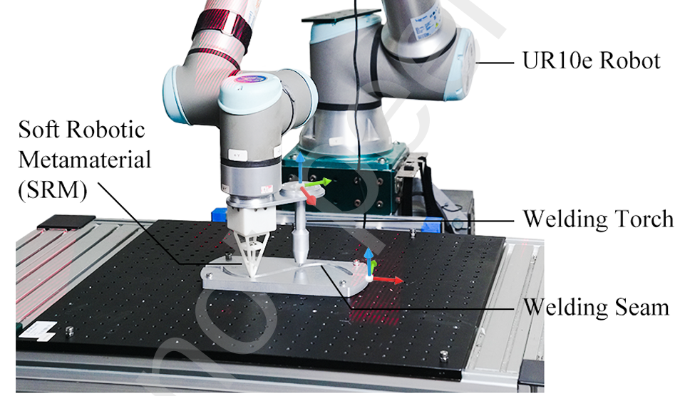

# 焊缝规划问题

## 1. 定义
给定工件A，通过视觉定位或者触觉定位的方法，获取工件A上待焊接区域B（焊缝），进而进行焊接。
- Q1：焊缝定位   
假设平面工件，焊缝低于工件上表面   

    1. 视觉定位：
        - 如本线激光方案：相机型号RVC-G31800？
        - 通过点云获取焊缝位置
    2. 触觉定位：
        - 柔性结构+二维码方案
        - 更具二维码姿态估计末端位置，通过手眼标定，获得焊缝位置 
- Q2：焊缝规划
    获得焊缝位置（机器人坐标系）后，机械臂末端焊枪沿焊缝运动。

## 2. 视觉定位方法
1. 线激光相机获取工件截面数据
2. 寻找工件表面
    - 截面数据处理，去噪
    - ransac 直线拟合
3. 拟合数据和原始数据的差--》焊缝缺口数据
4. 均值？，焊缝在截面的位置
5. 逐个截面拼接，整体焊缝位置

## 3. 触觉定位方法
1. 预定义入口
2. 根据柔性结构触摸，获得焊缝位置。

### 3.1 柔性结构尖端位置获取
通过二维码姿态计算指尖位置。假设二维码的姿态为$P_t^c$， 硬质杆长度为$L$。从二维码到尖端的变换矩阵$M$可以表示为：
$$M = 
\left[\begin{matrix}
    R & T \\
    \mathbf{0} & 1
\end{matrix}
\right]
$$
假设硬质连杆尖端在二维码z负半轴上，绕z轴旋转不影响末端位置，那么
$$R = 
\left[\begin{matrix}
    1 & 0 & 0\\
    0 & 1 & 0\\
    0 & 0 & 1\\
\end{matrix}
\right] 
;
T =\left[\begin{matrix}
    0\\
    0\\
    -L\\
\end{matrix}
\right] 
$$
在相机坐标系下，末端位置$S_t^c$为：
$$S_t^c = P_t^c M$$

通过CAD模型，可以得到二维码在机器人坐标系表示，
以正交基表示$E^r = \{e_1^r,e_2^r,e_3^r \}$，原点为$O^r = (x^r,y^r,z^r)$；二维码在相机坐标系其为$E^c = \{e_1^c,e_2^c,e_3^c \}$，原点为$O^c = (x^c,y^c,z^c)$；
相机坐标系到机械臂末端法兰坐标系的变换矩阵为$M^r_c$，那么有：
$$E^r = R^r_c E^c \Rightarrow R^r_c = E^r (E^c)^{-1}\\
O^r = O^c + T^r_c \Rightarrow T^r_c = O^r - O^c\\$$

$$
M^r_c = 
\left[\begin{matrix}
    R^r_c & T^r_c \\
    \mathbf{0} & 1
\end{matrix}
\right]
$$
如果考虑到误差问题，$E$不够正交，可以使用SVD分解$E=U \Sigma V^T$，使用单位阵替换特征矩阵，$\hat{E}=U I V^T = UV^T$，此处$\hat{E}$即为最接近的正交阵。由于旋转矩阵的行列式为1，而正交矩阵行列式为1或者-1，如果$\hat{E}$的行列式为-1，将$I$变为
$
\left[\begin{matrix}
    1 & 0 & 0\\
    0 & 1 & 0\\
    0 & 0 & -1\\
\end{matrix}
\right] 
$。

$E^r_c$也可以用SVD分解求解（AX=b问题。

触觉探针末端在机器人法兰坐标系下为：
$$S_t^r = M^r_c S_t^c$$

### 3.2 触觉探索规划
通过触觉探针在焊缝中移动，获得焊缝坐标。约束：触觉探针与焊枪距离保持不变；焊枪沿着焊缝切线匀速运动，无法向速度；探针焊枪沿着焊缝切线匀速运动，保持法向接触。

